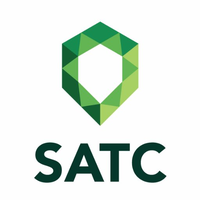

# infosatc-lp-avaliativo-07
Atividade avaliativa 07 da disciplina de linguagem de programação do curso técnico de informática SATC 2020

Técnico de Informatica

Linguagem de Programação

2020

Exercicios avaliativos, com base nas ativdades anteriores, concluidos conforme socitado pela professora Mariane Joaquim Melo

Pyton

<a href="https://github.com/Realdo-Justino/infosatc-lp-avaliativo-07/blob/main/exercicio-01.py">Exercicio-01</a>
 
<a href="https://github.com/Realdo-Justino/infosatc-lp-avaliativo-07/blob/main/exercicio-02.py">Exercicio-02</a>
 
<a href="https://github.com/Realdo-Justino/infosatc-lp-avaliativo-07/blob/main/exercicio-03.py">Exercicio-03</a>
 
<a href="https://github.com/Realdo-Justino/infosatc-lp-avaliativo-07/blob/main/exercicio-04.py">Exercicio-04</a>
 
<a href="https://github.com/Realdo-Justino/infosatc-lp-avaliativo-07/blob/main/exercicio-05.py">Exercicio-05</a>
 
<a href="https://github.com/Realdo-Justino/infosatc-lp-avaliativo-07/blob/main/exercicio-06.py">Exercicio-06</a>
 
<a href="https://github.com/Realdo-Justino/infosatc-lp-avaliativo-07/blob/main/exercicio-07.py">Exercicio-07</a>